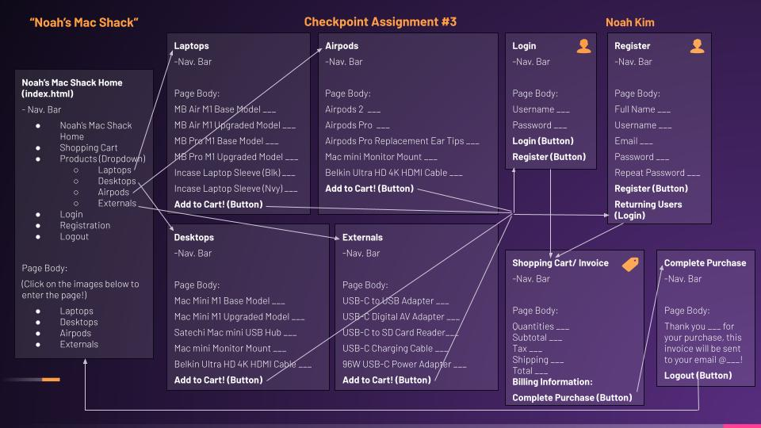

#### Link to my Checkpoint Assignment #3 Screencast
<a href="https://www.youtube.com/watch?v=BOlEsLiEGMs">Checkpoint Assignment #3 Screencast</a>

## Show what each page will look like. The pages do not have to be “functional” but the design should clear.

There will be four separate product pages (Laptops, Desktops, Airpods, and Externals. This will all be accessible in the navigation bar through a drop down button as well as links to these 4 pages on the Home page. The user is taken to those pages which are actually all generated through one file, my products.html, where I call my .js (JavaScript) array to display the contents within each variable (laptop, desktop, airpod, and external). I was able to do this by creating another variable, product_key, which I refer to retrieve the array, allProducts which contains the 4 product pages. My code to validate the quantities remain from my previous Assignments but I added a message and session so that the quantities are stored within the session for that particular user. There an alert will let them know whether their cart has been successfully updated or not and whether or not their quantities are valid. Following the user's selection, they are taken to the login page where they are required to either login or register. They will be taken to the Shopping Cart/ Invoice where they will be greeted by their username and a message. Users will be required to fill out their billing methods and review their order. Once this is completed the user will be taken to the Complete Purchase page and will be once again thanked personally by a message that identifies their name and email where their invoice will be sent. 

## Describe your design for your site’s shopping cart. That is, will it be a separate page that the user can view and edit, or will it be integrated into the product pages? If so, describe in detail how this will work on your site. Provide several examples of using the cart. 
The design for my shopping cart is to have an indicator of how many products are currently in the user's shopping cart that will be updated each time a user adds a quantity. When the user adds products to their cart, it will be saved as a session. It will not be a separate page but rather integrated into the product pages. My current Shopping Cart stores the user's quantities within the session so the indicator that I mentioned earlier will be a great addition to the user interface when completed. 

## Explain specifically how you will use sessions to manage your shopping cart. In particular, what shopping cart data will be stored in the session, what data format will be used (NOT what data type, but the format like with the data format used for your registration data). Use code examples showing what data structures (such as arrays and their objects) you will use to manage the shopping cart data and how they will be used in a session.
I am currently and will continue to use sessions by storing the product quantities within the session for my Shopping Cart. 

## How will you avoid access to your application when the user has not logged in or registered? What are the particular security concerns you must address?
As of right now, I have my server verfiy whether users are logged in/ registered, if they are not then they cannot purchase products or view their invoice. 

I still have to work on how to do this by utilizing cookies which will check whether or not the user has one. If the user does not have a cookie, I plan to make it so that they will not be able to checkout. It differs slightly from what I am doing now as I am only checking this through my server.js, login.html, and register.html rather than using cookies. After completing these security concerns, I plan on asking Professor Port for help with encryption. 

Possible security concerns are that users may still acces the checkout page withtout an account which is why I felt using cookies were integral in solidfying my application's security. 

## Upon a successful login, how do you provide personalization in your UI? Explain how you did or will do this (paste code if necessary).
Upon a successful login, my application already greets the user by their username and email on the invoice. The UI personalization is primarily displayed in the invoice and checkout page as users select quantities, then taken to login/ register, and are finally at the invoice. Therefore, UI personalization is done in the invoice because that is where they are taken right after the login/ register page. 

## If you are working with partners, how will you split up the work in your team so that you are working in parallel as effectively as possible? That is, who is doing what and when?
I am working completely by myself. 

## How are you approaching Assignment 3 differently than Assignment 2?
I am approaching Assignment 3 differently as I am taking more time to understand the code. I realized I was just coding without understanding the code fully which was clearly demonstrated in my one on one sessions with Professor Port. Additionally, I have gotten better at dividing and conquering my work, targeting specific pages or aspects of my website to work on first. For example, the first thing I worked on for Assignment 3 was adding new products, prices, descriptions, and images in my product_data.js. I am getting better understanding what I want to work on/ target first, whereas before I would work on one section of code or a page and multitask. 
